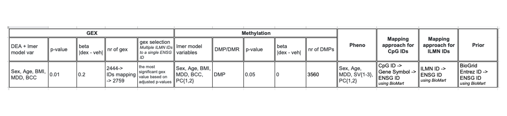

```{r setup, include=FALSE}
library(knitr)
options(digits = 4, width = 100, stringsAsFactors = T)
knitr::opts_chunk$set(echo = TRUE,
                      tidy.opts = list(width.cutoff = 100),
                      tidy=TRUE,
                      fig.pos = "H",
                      dpi = 600,
                      warning = FALSE, 
                      message = FALSE, 
                      cache = F, 
                      cache.lazy = FALSE)
```


<!-- ### The GEX Roadmap -->

<!--  -->


<!-- ### The DNAm Roadmap -->

<!--  -->

### Input parameters

{width=1080px}


```{r, include = F, echo = F}
libraries <- c("data.table", "tidyr", "dplyr", "ggplot2", "RColorBrewer", "ggthemes", "igraph", "qgraph", "purr")
lapply(libraries, require, character.only = TRUE)
```

```{r, include=F}
# Set up parameter
data.dir.pre    <- "/Users/anastasiia_hry/bio/datasets/kimono/"
kimono.res.fn   <-  paste0(data.dir.pre, "output/kimono_res_veh.csv") # experiment nr 2
map.ilmn.tbl.fn <- paste0(data.dir.pre, "/mapping/mapping_ilmn_ensg_gene.csv") #"/mapping/mapping_ilmn_ens.csv")
map.cpg.tbl.fn  <- paste0(data.dir.pre, "/mapping/mapping_cpg_gene_ensg.csv")
```

### 1. Load Kimono results and filter them

```{r, cache = F}
kimono.res.fn         <- paste0(data.dir.pre, "output/kimono_res_veh.csv") # experiment nr 2
kimono.res            <- fread(kimono.res.fn)
map.ilmn.ensg.tbl     <- read.csv2(map.ilmn.tbl.fn)
map.cpg.gene.ensg.tbl <- read.csv2(map.cpg.tbl.fn)

map.ensg.gene.tbl     <- map.ilmn.ensg.tbl[, c("Ensemble_ID", "Gene_ID")] %>% unique() 
```

### 2. Explore results
```{r, cache = F}
kimono.net <- kimono.res[value != 0, ] 

paste("Number of successful models:", length(unique(kimono.net$target)))
paste("Number of unique predictors:", length(unique(kimono.net$predictor))) 
```

### 2.1. Check-up GEX: mapping kimono results to ILMN IDs

```{r, cache = F}
kimono.merged <- merge(kimono.net[, .(target)], 
                  map.ilmn.ensg.tbl, 
                  by.x = "target", by.y = "Ensemble_ID", all.x = T, allow.cartesian = T) %>%  unique()

num.ilmn.ids.per.ensg.df <- kimono.merged[, .N, by = target][order(-N)][N > 1,]
paste("Number of ILMN ID that have multiple ENSG IDs associated:", nrow(num.ilmn.ids.per.ensg.df) )

num.ilmn.ids.per.ensg.df

"List of ILMN IDs that have multiple ENSG IDs:"
kimono.merged[target %in% num.ilmn.ids.per.ensg.df$target,]

paste("Number of unique ILMN IDs: ", length(unique(kimono.merged$Illumina_ID)))
paste("Number of unique Gene IDs: ", length(unique(kimono.merged$Gene_ID)))
paste("Number of unique ENSG IDs: ", length(unique(kimono.merged$target)))

```

### 2.2. Check-up methylation data: mapping kimono results to CpG IDs

```{r, cache = F}
kimono.merged <- merge(kimono.net[, .(target)], 
                  map.cpg.gene.ensg.tbl, 
                  by.x = "target", by.y = "Ensemble_ID", all.x = T, allow.cartesian = T) %>%  unique() %>% na.omit()

num.cpg.ids.per.ensg.df <- kimono.merged[, .N, by = target][order(-N)][N > 1,]
paste("Number of CpG ID that have multiple ENSG IDs associated:", nrow(num.cpg.ids.per.ensg.df) )

num.cpg.ids.per.ensg.df

"List of CpG IDs that have multiple ENSG IDs:"
kimono.merged[target %in% num.cpg.ids.per.ensg.df$target,]

paste("Number of unique CpG IDs: ", length(unique(kimono.merged$CpG_ID)))
paste("Number of unique Gene IDs: ", length(unique(kimono.merged$Gene_ID)))
paste("Number of unique ENSG IDs: ", length(unique(kimono.merged$target)))
```

### 3. Create network

```{r}
beta.trsh <- 0.2
rsq.trsh  <- 0.01

network <- kimono.net %>% filter((value > beta.trsh) | (value < (-beta.trsh))) %>%
  filter(r_squared > rsq.trsh) %>%
  filter(predictor != '(Intercept)') %>% setDT
```

### 4. Inspect associations

```{r}

paste("Number of successful models in the network with parameters beta = ", beta.trsh, "and rsq = ", rsq.trsh, ":" , length(unique(network$target)))
paste("Number of unique predictors in the network with parameters beta = ", beta.trsh, "and rsq = ", rsq.trsh, ":" , length(unique(network$predictor))) 

paste0("Fraction after filtering: ", nrow(network) / nrow(kimono.net))
paste0("Fraction after filtering (unique targets): ", length(unique(network$target)) / length(unique(kimono.net$target)))
paste0("Fraction after filtering (unique predictors): ", length(unique(network$predictor)) / length(unique(kimono.net$predictor)))
```

### 4.1. Inspect predictors

```{r}
# unique predictors
unique(network, by = c("relation", "predictor")) %>% .[,.N, by = relation]

network[, .N, by = predictor][order(-N)]

unique(network[relation == "expr_pheno", predictor])
network[relation == "methyl_expr", predictor] %>% unique %>% head
network[relation == "prior_expr", predictor] %>% unique %>% head

```

```{r}
degrees        <- dplyr::count(network, predictor) %>% mutate(network = "total")
degrees.gex    <- dplyr::count(network[network$relation == "prior_expr",], predictor) %>% mutate(network = "gex") 
degrees.methyl <- dplyr::count(network[network$relation == "methyl_expr",], predictor) %>% mutate(network = "methylation")
degrees.pheno  <- dplyr::count(network[network$relation == "expr_pheno",], predictor) %>% mutate(network = "pheno")

degrees[order(-n),]

degrees.df         <- rbind(degrees, degrees.gex, degrees.methyl, degrees.pheno)
degrees.df$network <- as.factor(degrees.df$network)

ggplot(degrees.df, aes(x = network, y = n, fill = network)) +
  geom_boxplot() +
  labs(title = "Distribution of node degrees by layer",
       y = "Node degree")
  
```

### 4.2. Inspect relations

```{r}
network[, .N, by = relation]

ggplot(network, aes(relation)) + 
  geom_bar(stat = "count", fill = "purple") + 
  geom_text(stat = "count", aes(label=..count..), 
            vjust = 1.5, color = "white", position = position_dodge(0.9), size = 3.5)
```
### 4.3. Beta and R-SQ analysis
```{r}
nbins = nrow(kimono.net) / 500

kimono.net[,.(target, r_squared)] %>% unique() %>% 
  ggplot(., aes(r_squared)) +
  geom_density() + 
  geom_histogram(bins = nbins) + 
  geom_vline(xintercept = rsq.trsh, color = "red") +
    geom_text(aes(x = rsq.trsh / 1e3, label =  paste0("x = ", rsq.trsh), y = 75), colour = "red", angle = 90, text = element_text(size = 5)) +  
  theme_tufte() +
  labs(title = "Distribution of targets", x = "R sq")

ggplot(kimono.net, aes(value)) + 
  geom_histogram(bins = nbins) +
  geom_vline(xintercept = beta.trsh, color = "red") +
    # geom_text(aes(x = beta.trsh / 1.2, label = paste0("x = ", beta.trsh), y = 10000), colour = "red", angle = 90, text = element_text(size = 5)) +  
  geom_vline(xintercept = -beta.trsh, color = "red") +
    # geom_text(aes(x = -beta.trsh / 1.2, label =  paste0("x = -", beta.trsh), y = 10000), colour = "red", angle = 90, text = element_text(size = 5)) +
  theme_tufte() + 
  labs(title = "Distribution of effect size",
       x = "Effect size")

ggplot(network, aes(value)) + 
  geom_histogram(bins = nbins) +
  geom_vline(xintercept = beta.trsh, color = "red") +
    geom_text(aes(x = beta.trsh / 1.2, label = paste0("x = ", beta.trsh), y = 200), colour = "red", angle = 90, text = element_text(size = 5)) +  
  geom_vline(xintercept = -beta.trsh, color = "red") +
    geom_text(aes(x = -beta.trsh / 1.2, label = paste0("x = -", beta.trsh), y = 200), colour = "red", angle = 90, text = element_text(size = 5)) +
  theme_tufte() + 
  labs(title = "Distribution of effect sizes",
       x = "Effect size") 

```

```{r rsq-distr-before-filtering}
rsq.df     <- kimono.net %>% 
  filter(predictor != '(Intercept)') %>% 
  select(target, r_squared, relation) %>% 
  unique() 

rsq.tmp.df <- rsq.df %>% mutate(relation = "All")
rsq.df     <- rbind(rsq.tmp.df, rsq.df)

rsq.df[relation == "expr_pheno", relation := "Biological"]
rsq.df[relation == "methyl_expr", relation := "Methylation"]
rsq.df[relation == "prior_expr", relation := "Transcriptome"]

rsq.df$relation <- as.factor(rsq.df$relation)

ggplot(rsq.df, aes(x = relation, y = r_squared, fill = relation)) +
  geom_boxplot() +
  theme(legend.position = "none") +
  labs(title = "Network Rsq on all gene models before filtering",
       x = "Layer", y = "R sq") 
  
```

```{r rsq-distr-after-filtering}
rsq.df     <- network %>% select(target, r_squared, relation) %>% unique() #%>% setDT
rsq.tmp.df <- rsq.df %>% mutate(relation = "All")
rsq.df     <- rbind(rsq.tmp.df, rsq.df)

rsq.df[relation == "expr_pheno", relation := "Biological"]
rsq.df[relation == "methyl_expr", relation := "Methylation"]
rsq.df[relation == "prior_expr", relation := "Transcriptome"]

rsq.df$relation <- as.factor(rsq.df$relation)

ggplot(rsq.df, aes(x = relation, y = r_squared, fill = relation)) +
  geom_boxplot() +
  theme(legend.position = "none") +
  labs(title = paste0("Network Rsq on all gene models after filtering for beta = ", beta.trsh, " and R sq = ", rsq.trsh),
       x = "Layer", y = "R sq") 
  
```

### 5. Create graph

```{r}
vertices <- unique(c(network$predictor, network$target))
edges    <- data.frame(from = network$predictor,
                       to = network$target,
                       beta = network$value,
                       rsq = network$r_squared) 

paste("Number of vertices: ", length(vertices))
paste("Number of edges: ", nrow(edges))

g <- graph_from_data_frame(edges, vertices, directed = FALSE)
print(g)
```

### Graph infromation

```{r}

degree          <- degree(g, mode="all")
degree.distr    <- degree_distribution(g, cumulative = T, mode = "all")
closeness       <- closeness(g, mode = "all") 
betweennes.vert <- betweenness(g, directed = F)
betweennes.edge <- edge_betweenness(g, directed = F)

graph.statistics <- data.frame(degree,
                               closeness,
                               betweennes.vert)[order(-betweennes.vert),]

paste("Number of vertices: ", length(vertices))
paste("Number of vertices with betweenness = 0: ", nrow(graph.statistics[betweennes.vert == 0,]) )

graph.statistics
```

#### Plot betweenness

```{r}
ggplot(graph.statistics, aes(betweennes.vert)) +
  geom_density() + 
  geom_histogram(bins = 50) + 
  scale_x_continuous(trans = 'log2',
                     labels = scales::number_format(accuracy = 1)) +
  labs(x = "Vertix betweenness",
       y = "Density")
```

```{r}
num.vert <- 50

ggplot(graph.statistics[1:num.vert,], aes(x = 1:num.vert, y = betweennes.vert )) +
  geom_bar(stat = "identity") +
  labs(x = paste0("First ", num.vert, " predictors"),
       y = "Vertex betweenness")
```


#### Take first 10 ENSG ID for further analysis

```{r}
num.vert <- 50 + 3
top.vert.df <- graph.statistics[4:num.vert,] %>% select(betweennes.vert) %>% mutate()

top.vert.df <- merge(top.vert.df, map.ensg.gene.tbl, by.x = "row.names", by.y = "Ensemble_ID") %>% 
  mutate(Ensemble_ID = Row.names) %>% select(Ensemble_ID, Gene_ID)

paste("Number of uniqe ENSG IDs: ", length(unique(top.vert.df$Ensemble_ID)))
paste("Number of uniqe Gene IDs: ", length(unique(top.vert.df$Gene_ID)))
```

### Plot subnetwork for obtained gene list

```{r}
top.ensg.ids <- top.vert.df$Ensemble_ID

subnet <- network[((target %in% top.ensg.ids) | (predictor %in% top.ensg.ids)) & predictor!="(Intercept)",]
subnet <- data.frame(lapply(subnet, as.character), stringsAsFactors = FALSE)

lable    <- unique(c(paste0("expr-", subnet$target), paste0(subnet$relation, "-", subnet$predictor)))
vertices <- data.frame(name = do.call(rbind, strsplit(lable, "-") )[, 2],
                       omic = do.call(rbind, strsplit(lable, "-") )[, 1])

relations  <- data.frame(from = subnet$predictor,
                         to = subnet$target,
                         value = subnet$value,
                         rsq = subnet$r_squared) 


vertices <- unique(vertices) %>%  setDT
vertices[,.N, by = name][order(-N)]
vertices[omic == "prior_expr", omic:="expr"]
vertices <- unique(vertices)

# summary(vertices)

# Create graph
g <- graph_from_data_frame(relations, vertices, directed = FALSE)

# plot(g, vertex.label.color = "black", vertex.size = 5, vertex.label = NA)

num.edge.thr <- 5

deg <- degree(g, mode = "all")

vertices[, edges := deg]
# vertices[order(-edges)]

vertices$name      <- as.character(vertices$name)
vertices$omic      <- as.character(vertices$omic)
vertices$new_names <- as.character(vertices$new_names)

# Create new names for adding label to plot
vertices[, new_names := name]
vertices[edges < num.edge.thr, new_names := NA]

# Map ENSG ID to Gene Symbol
vertices <- left_join(vertices, map.ensg.gene.tbl, by = c("new_names" = "Ensemble_ID"), all.x = T)
vertices[omic == "expr", new_names := Gene_ID]

# Map CpG to Gene Symbol
vertices[, methyl_names := name]
vertices[omic != "methyl_expr", methyl_names := NA]
vertices <- left_join(vertices, map.cpg.gene.ensg.tbl[, c("CpG_ID", "Gene_ID")], by = c("methyl_names" = "CpG_ID"), all.x = T)
vertices[omic == "methyl_expr", new_names := Gene_ID.y]

# Make bio nodes visible on the plot
vertices[omic == "expr_pheno", new_names := name]

# Set colour pallet 
col <-c(brewer.pal(3, "Set2"))
vertices[omic == "expr", colour := col[1]]
vertices[omic == "methyl_expr", colour:=col[2]]
vertices[omic == "expr_pheno", colour:=col[3]]

vertices[!is.na(new_names), ][order(-edges)]

plot(g, # layout = layout_with_kk, # layout = layout.fruchterman.reingold(g),
     vertex.frame.color = adjustcolor("black", .4), 
     vertex.size = 2 + (log(deg) * 2),
     vertex.color = vertices$colour,
     vertex.label = vertices$new_name,
     vertex.label.color = adjustcolor("black", 1),
     vertex.label.cex = .7,    
     vertex.label.family = "Helvetica",
     edge.color =  adjustcolor("grey", .8),
     edge.curved = .3,
     asp = .8)
legend("bottomleft", c("gex", "methyl", "pheno"),
       pch = 21, pt.bg = col, pt.cex = 1.5, cex = .7, bty = "n")

# plot(g, vertex.label.color = "black", vertex.size = 5, vertex.label = vertices$new_names)

# shortest.path <- shortest.paths(g)
```


