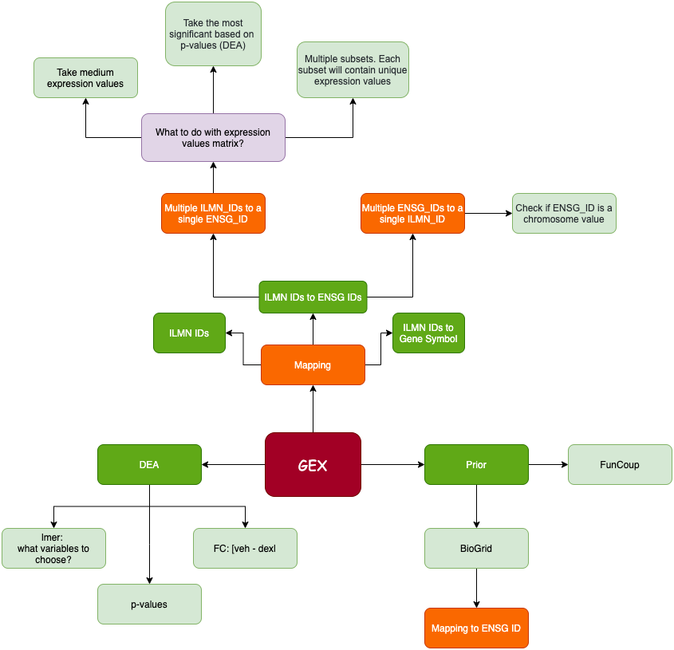
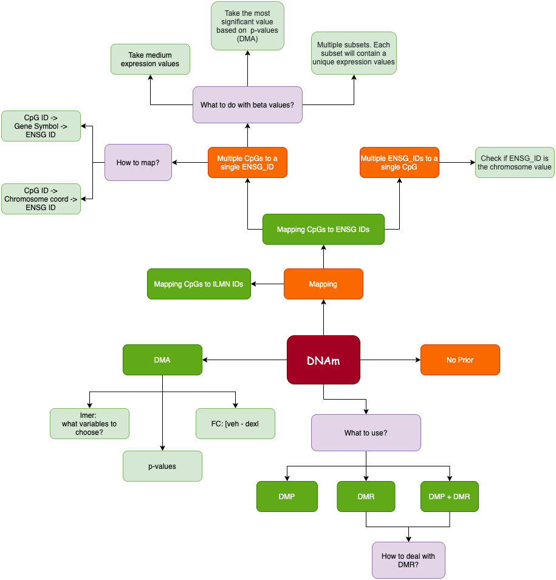

```{r setup, include=FALSE}
library(knitr)
options(digits = 4, width = 100, stringsAsFactors = T)
knitr::opts_chunk$set(echo = TRUE,
                      tidy.opts = list(width.cutoff = 100),
                      tidy=TRUE,
                      fig.pos = "H",
                      dpi = 600,
                      warning = FALSE, 
                      message = FALSE, 
                      cache = F, 
                      cache.lazy = FALSE)
```


<!-- ### The GEX Roadmap -->

<!--  -->


<!-- ### The DNAm Roadmap -->

<!--  -->

### Input parameters


| Data type       | Nr of vars  <br /> original  |Nr of vars  <br /> after mapping | LMER variables                                    | p value <br /> (LMER) | FC value <br /> (LMER) | Additional Info                                   |
| :-------------- | :--------------------------- |:------------------------------- | :------------------------------------------------ | :-------------------- | :--------------------- |:--------------------------------------------------| 
| GEX             | 12,417                       | 11,959                          | Sex, Age, BMI, <br /> MDD, BCC                    | 0.0                   | 0.0                    | for kimono input, values are chosen based on pFDR |
| DNAm            | 349,390                      |                                 | Sex, Age, BMI, <br /> MDD, BCC, PC<sub>1,2</sub>  | 0.9                   | 0.0                    | only DMPs                                         |
| SNP             | 100,149 <br /> &nbsp;        |                                 |                                                   |                       |                        |                                                   |
| Pheno           | 8                            |                                 |                                                   |                       |                        | Sex, Age, BMI, BCC      |

```{r load-libs, include = F, echo = F, warning = F}
libraries <- c("data.table", "tidyr", "dplyr", "ggplot2", "RColorBrewer", "ggthemes", "igraph", "qgraph", "purr", "DT")
lapply(libraries, require, character.only = TRUE)
```

```{r setup-params, include=F}
# Set up parameter
data.dir.pre    <- "~/bio/datasets/kimono/"
# kimono.res.fn   <- paste0(data.dir.pre, "output/kimono_res_dex.csv") # experiment nr 5
map.ilmn.tbl.fn <- paste0(data.dir.pre, "/mapping/mapping_ilmn_ensg_gene.csv") #"/mapping/mapping_ilmn_ens.csv")
map.cpg.tbl.fn  <- paste0(data.dir.pre, "/mapping/mapping_cpg_gene_ensg_full.csv")
map.snp.tbl.fn  <- paste0(data.dir.pre, "/mapping/mapping_snp_gene_distance.csv")
```

### 1. Load Kimono results and filter them

```{r load-data, cache = F}
kimono.res.veh        <- fread(paste0(data.dir.pre, "output/kimono_res_veh.csv"))
kimono.res.dex        <- fread(paste0(data.dir.pre, "output/kimono_res_dex.csv"))
```

```{r}
map.ilmn.ensg.tbl     <- read.csv2(map.ilmn.tbl.fn)
map.cpg.gene.ensg.tbl <- fread(map.cpg.tbl.fn) %>% unique() %>% na.omit()
map.snp.gene.dist.tbl <- fread(map.snp.tbl.fn)

map.ensg.gene.tbl     <- map.ilmn.ensg.tbl[, c("Ensemble_ID", "Gene_ID")] %>% unique() 
# For multiple SNPs, take the one which is closet to the gene
map.snp.gene.dist.tbl <- map.snp.gene.dist.tbl %>%
   na.omit() %>%
   group_by(SNP) %>% 
   dplyr::slice(which.min(Distance))
```

### Compute means and se

```{r}
library(plyr)

# Function 
se <- function(x) sqrt(var(x)/length(x))

CalculateMeanSE <- function(data){
  data.tmp <- data # %>% filter(predictor != '(Intercept)')
  stat.df <- ddply(data.tmp, .(target), summarize, beta_mean = mean(value), beta_se = sd(value))
  data.final <- left_join(data, stat.df)
  
  return(data.final)
}

kimono.dex <- CalculateMeanSE(kimono.res.dex)
kimono.veh <- CalculateMeanSE(kimono.res.veh)
```

### 2. Explore results
```{r basic-kimono-res, cache = F}

z_score <- function(beta_t, beta_c, se_t, se_c){
  z <- (beta_t - beta_c)/
    sqrt((se_t)^2 + (se_c)^2)
}

p_val_z_score <- function(z)
  2 * pnorm(-abs(z))

fdr_cutoff <- 0.05
rsquared_cutoff <- 0.01
beta_cutoff <- 0.02

data <- inner_join(kimono.veh, kimono.dex, 
                   by = c("target", "predictor"),
                   suffix = c("_veh", "_dex"))
# dex_notBase <- anti_join(kimono.res.dex, kimono.res.veh, by = c("target", "predictor"))

# Plot beta values
# beta_data <- as.data.frame(rbind(cbind(rep("base", times = nrow(data)), data$beta_mean.base, data$relation.base),
#                                  cbind(rep("dex", times = nrow(data)), data$beta_mean.dex, data$relation.dex)))

data <- data %>% 
  filter(r_squared_veh >= rsquared_cutoff, r_squared_dex >= rsquared_cutoff) %>%
  filter(predictor != '(Intercept)')

# data <- mutate(data, z = z_score(beta_mean_dex, beta_mean_veh, beta_se_dex, beta_se_veh))
data <- mutate(data, z = z_score(value_dex, value_veh, beta_se_dex, beta_se_veh))
hist(data$beta_mean_veh)
hist(data$beta_mean_dex)
hist(data$z)

data.diff.grn <- data %>%
  mutate(diff = (abs(value_veh) > beta_cutoff | abs(value_dex) > beta_cutoff)) %>%
 # mutate(diff = (abs(beta_mean_veh) > beta_cutoff | abs(beta_mean_dex) > beta_cutoff)) %>%
  filter(diff) %>% 
  mutate(p_diff_grn = p_val_z_score(z)) %>%
  mutate(fdr = p.adjust(p_diff_grn, method = "fdr"))%>%
  filter(fdr <= fdr_cutoff)
  
#head(data.diff.grn[,c("beta_mean.base", "beta_stderr.base", "beta_mean.dex", "beta_stderr.dex", "z", "p_adj")], 20)
```

```{r}
# Nodes in network
  node_vec <- unique(c(data.diff.grn$target, data.diff.grn$predictor))
  
  # Find modules
  relations <- data.frame(from=data.diff.grn$target,
                          to=data.diff.grn$predictor,
                          value=data.diff.grn$z,
                          performance=data.diff.grn$fdr) 
  g <- graph_from_data_frame(relations, directed=FALSE, vertices=node_vec)
  
```

```{r}
degree          <- degree(g, mode="all")
degree.distr    <- degree_distribution(g, cumulative = T, mode = "all")
# closeness       <- closeness(g, mode = "all") 
betweennes.vert <- betweenness(g, directed = F)
# betweennes.edge <- edge_betweenness(g, directed = F)

graph.statistics <- data.frame(degree,
                               # closeness,
                               betweennes.vert)[order(-betweennes.vert),]

paste("Number of vertices: ", length(vertices))
paste("Number of vertices with betweenness = 0: ", nrow(graph.statistics[betweennes.vert == 0,]) )

datatable(graph.statistics)
```
#### Plot betweenness

```{r plot-betweenness-first-n-vert}
num.vert <- 50

ggplot(graph.statistics[1:num.vert,], aes(x = 1:num.vert, y = betweennes.vert )) +
  geom_bar(stat = "identity") +
  labs(x = paste0("First ", num.vert, " predictors"),
       y = "Vertex betweenness")
```

#### Take first 10 ENSG ID for further analysis

```{r take-first-n-genes}
num.vert <- 30 + 3
top.vert.df <- graph.statistics[1:num.vert,] %>% dplyr::select(betweennes.vert) %>% mutate()

top.vert.df <- merge(top.vert.df, map.ensg.gene.tbl, by.x = "row.names", by.y = "Ensemble_ID") %>% 
  mutate(Ensemble_ID = Row.names) %>% dplyr::select(Ensemble_ID, Gene_ID)

paste("Number of uniqe ENSG IDs: ", length(unique(top.vert.df$Ensemble_ID)))
paste("Number of uniqe Gene IDs: ", length(unique(top.vert.df$Gene_ID)))
```

### 5.2. Plot subnetwork for obtained gene list

```{r plor-ntwrk}
top.ensg.ids <- top.vert.df$Ensemble_ID

subnet <- data.diff.grn[((target %in% top.ensg.ids) | (predictor %in% top.ensg.ids)) & predictor!="(Intercept)",]
subnet <- data.frame(lapply(subnet, as.character), stringsAsFactors = FALSE)

lable    <- unique(c(paste0("expr-", subnet$target), paste0(subnet$relation_dex, "-", subnet$predictor)))
vertices <- data.frame(name = do.call(rbind, strsplit(lable, "-") )[, 2],
                       omic = do.call(rbind, strsplit(lable, "-") )[, 1])

relations  <- data.frame(from = subnet$predictor,
                         to = subnet$target,
                         value = subnet$z,
                         rsq = subnet$fdr) 


vertices <- unique(vertices) %>%  setDT
# vertices[,.N, by = name][order(-N)]
vertices[omic == "prior_expr", omic:="expr"]
vertices <- unique(vertices)

# summary(vertices)

# Create graph
g <- graph_from_data_frame(relations, vertices, directed = FALSE)

num.edge.thr <- 3
deg <- degree(g, mode = "all")
vertices[, edges := deg]
# vertices[order(-edges)]

vertices$name      <- as.character(vertices$name)
vertices$omic      <- as.character(vertices$omic)
vertices$new_names <- as.character(vertices$new_names)

# Create new names for adding label to plot
vertices[, new_names := name]
vertices[edges < num.edge.thr, new_names := NA]

# Map ENSG ID to Gene Symbol
vertices <- left_join(vertices, map.ensg.gene.tbl, by = c("new_names" = "Ensemble_ID"), all.x = T)
vertices[omic == "expr", new_names := Gene_ID]

# Map CpG to Gene Symbol
vertices[, methyl_names := name]
vertices[omic != "methyl_expr", methyl_names := NA]
# vertices <- join(vertices, map.cpg.gene.ensg.tbl[, c("CpG_ID", "Gene_ID")], by = c("methyl_names" = "CpG_ID"), type = "left", match = "first")
 vertices <- semi_join(vertices, map.cpg.gene.ensg.tbl[, c("CpG_ID", "Gene_ID")], by = c("methyl_names" = "CpG_ID"), match = "first")
vertices[omic == "methyl_expr", new_names := Gene_ID.y]
vertices[omic == "methyl_expr", new_names := name]

# Make bio nodes visible on the plot
vertices[omic == "expr_pheno", new_names := name]

# Map SNP to Gene Symbol
vertices[, snp_names := name]
vertices[omic != "snp_expr", snp_names := NA]
vertices <- left_join(vertices, map.snp.gene.dist.tbl[, c("SNP", "Gene_ID")], by = c("snp_names" = "SNP"), all.x = T)
vertices[omic == "snp_expr", new_names := Gene_ID]
vertices[omic == "snp_expr", new_names := name]

# Set colour pallet 
col <-c(brewer.pal(4, "Set2"))
vertices[omic == "expr", colour := col[1]]
vertices[omic == "methyl_expr", colour:=col[2]]
vertices[omic == "expr_pheno", colour:=col[3]]
vertices[omic == "snp_expr", colour:=col[4]]

datatable(vertices[!is.na(new_names),][order(-edges)] %>% dplyr::select(name, omic, edges, new_names))

# View(na.omit(cbind(vertex_attr(g)$name, vertices$name, vertices$new_names)))

plot(g, # layout = layout_with_kk, # layout = layout.fruchterman.reingold(g),
     vertex.frame.color = adjustcolor("black", .4), 
     vertex.size = 2 + (log(deg) * 2),
     vertex.color = vertices$colour,
     vertex.label = vertices$new_name,
     vertex.label.color = adjustcolor("black", 1),
     vertex.label.cex = .7,    
     vertex.label.family = "Helvetica",
     edge.color =  adjustcolor("grey", .8),
     edge.curved = .3,
     asp = .8)
legend("bottomleft", c("gex", "methyl", "pheno", "snp"),
       pch = 21, pt.bg = col, pt.cex = 1.5, cex = .7, bty = "n")

```


